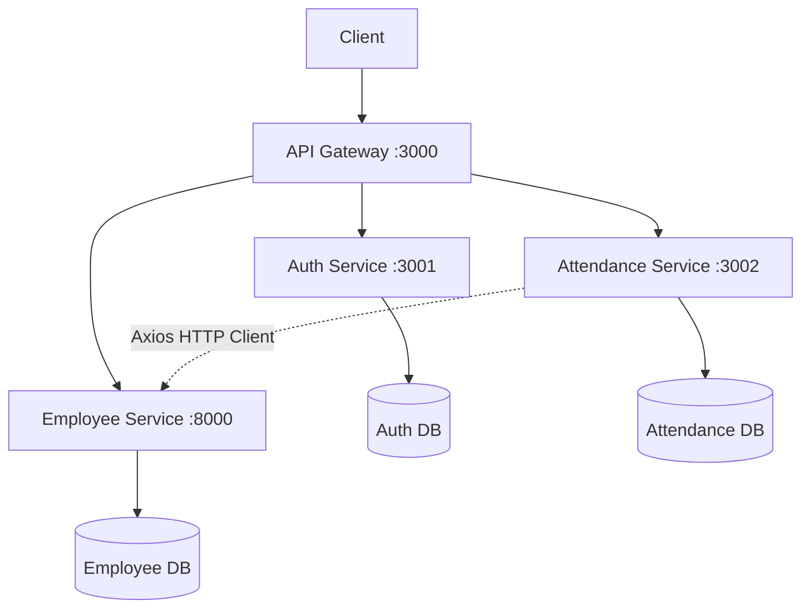

# Dokumentasi Arsitektur Sistem Kepegawaian & Absensi

## 1. Ikhtisar (Overview)
Sistem ini menggunakan arsitektur **Microservices** yang dikelompokkan berdasarkan ranah bisnis (business domains), dengan satu titik masuk terpusat. Tujuannya adalah memastikan setiap modul bersifat independen (terisolasi) dan mudah dikembangkan.

## 2. Diagram Logis

## 3. Komponen Layanan
1. **API Gateway (Node.js/Express)**
   - Port: 3000
   - Tanggung jawab: Bertindak sebagai proxy (*reverse proxy*), membatasi laju permintaan (*Rate Limiting* 60 request/menit), serta mencegat dan memvalidasi JSON Web Token (JWT).

2. **Auth Service (Node.js/Express)**
   - Port: 3001
   - Tanggung jawab: Mengelola proses otentikasi. Layanan ini mengimplementasikan skema **Google OAuth 2.0** melalui `passport.js` dan bertugas mencetak token JWT.

3. **Employee Service (PHP Laravel 11)**
   - Port: 8000
   - Tanggung jawab: Layanan inti untuk manajemen sumber daya manusia. Menyediakan operasi CRUD untuk tabel *Departments*, *Positions*, *Employees*, dan *Employee Contacts*. Dilengkapi dengan fitur penapisan (filtering) dan pemuatan bertahap (paging).

4. **Attendance Service (Node.js/Express)**
   - Port: 3002
   - Tanggung jawab: Mengelola data presensi dan rekapitulasi kehadiran. Mendemonstrasikan komunikasi antar-layanan (*inter-service communication*) dengan melakukan *fetch* data profil pegawai dari *Employee Service*.
